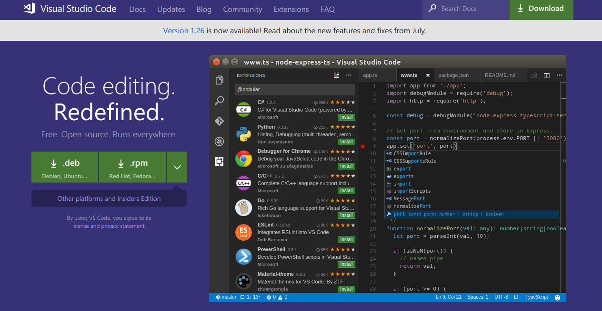
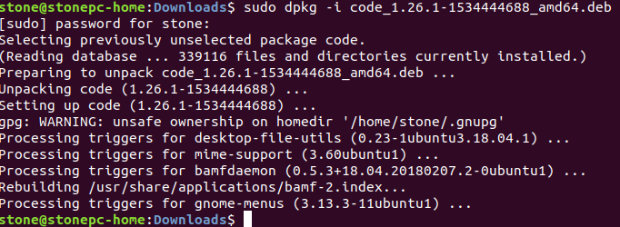
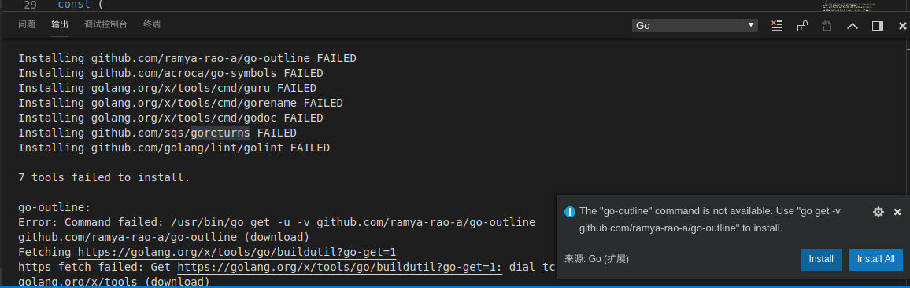
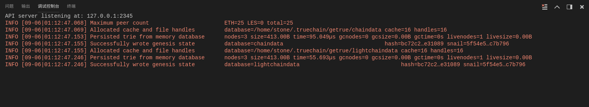
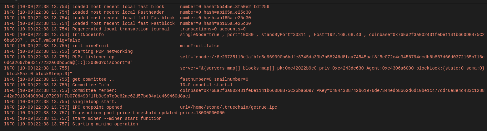
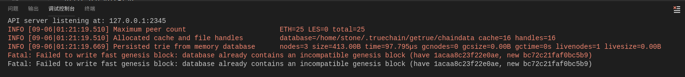
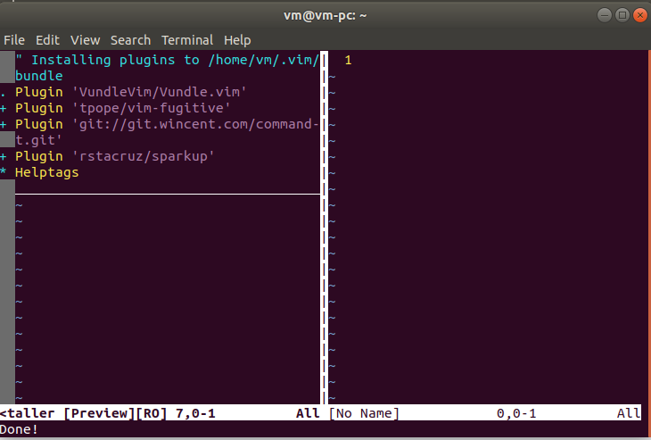
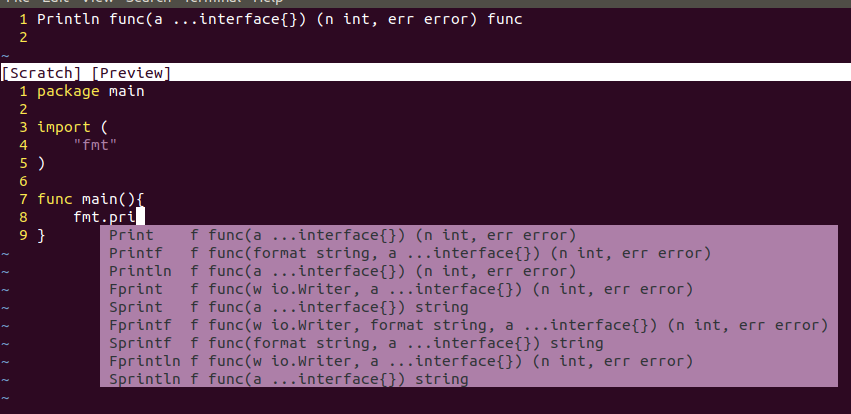
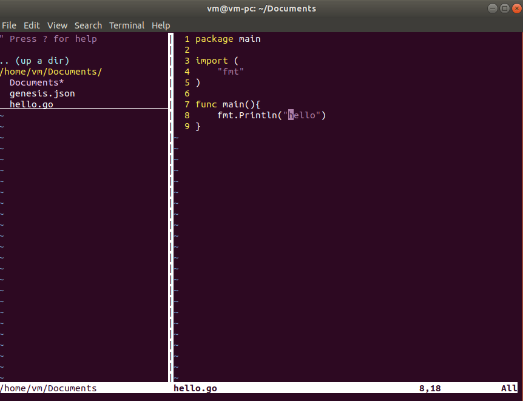

## TrueChain development preparation - build the environment(VSCode & Vim)
Author: Stone  Review: Zack  
This article mainly told you how to run TrueChain via VSCode and  make Vim to a powerful IDE in Ubuntu. the steps are the same when you use other Linux ,like CentOS, RHEL  
First of all, you must install GoLang,  you can follow the instruction by go to   
[https://golang.org/doc/install](https://golang.org/doc/install)  
There are many IDEs, choose the one you like.

### System Version: Ubuntu 18.04
Note:
1. The installation steps in other System are a little different, e.g. for CentOS, RHEL should use “yum” instead of “apt-get”.
2. In  other Ubuntu version, the output may have a little difference.

### Preparation
Install some tools :
```
$ sudo apt-get install cmake
$ sudo apt-get install python-dev python3-dev
$ sudo apt-get install build-essential
```

VSCode Installation
Tools needed: Visual Studio Code

Install VSCode
First,download the package from [https://code.visualstudio.com/](https://code.visualstudio.com/) , the page like this:


I use Ubuntu, so download .deb package. Then we got a file named “code_1.26.1-1534444688_amd64.deb”(the version may be different).  
 Then, we begin to install:  
 
```
$ cd path/to/deb_file		// change to the direction where contains deb  
$ sudo dpkg -i code_1.26.1-1534444688_amd64.deb 	// install

```

The installation process like this:  
  

there are two ways to open VSCode:
1.	From terminal:
```
$ nohup code & 	// Don’t forget “&”
```
2.	Press “Win” key, then search “vscode”, you can find it.
Then , you  can install some extensions. Open “extensions” from sidebar, then search “Go”, then install.   
Now,  VSCode is installed.

### Compile TrueChain with VSCode
This is almost the same when you do it  in Windows, just a little different.

First, download the code:
```
$ cd $GOPATH/src/truechain
$ git clone https://github.com/truechain/truechain-engineering-code.git

```
open the truechina-engineering-code folder by VSCode.

VSCode will told you to install same dependents, click “Install All”.

  

Sometime, some extensions  may be install failed. You can ignore them, because it will not effect compile the TrueChain code.

If you are a perfectionist, like me, you can follow the steps below.

### (Option) Process the FAILED  
Method: install the failed extensions manually  
1.	Process the extensions in “golang.org\x\tools”
Choose a directory, then download “tools” source code:
`$ git clone https://github.com/golang/tools.git`

Then, get the path from install failed prompt, copy the folder to “$GOPATH/src/golang.org/x/tools”.
e.g., the error message says “Installing golang.org/x/tools/cmd/gorename FAILED”, then copy the folder like this:
`$ cp -r cmd/gorename $GOPATH/src/golang.org/x/tools/cmd/gorename`

install the package:
`$ sudo go install golang.org/x/tools/cmd/gorename`

2.	Process the extensions about “github.com”  
 it is also download it from github and then install.   
 For example, the error message “Installing github.com/ramya-rao-a/go-outline FAILED”, we can process it like this:
```
$ cd $GOPATH/src/github.com
$ git clone https://github.com/ramya-rao-a/go-outline.git
```

// then
`$ go install github.com/ramya-rao-a/go-outline`


Now,  VSCode is installed.

We can have a test now:

write a  test.go in VSCode:  
```go
package main

import (
	"fmt"
)

func main() {
	fmt.Println("Hello, TrueChain")
}

```
press “F5”, it should print Hello, TrueChain".

** in Linux, VSCode will not pop up the "launch.json" file,   
it will run directly, and no error will be reported,   
because the running parameters haven’t  configured.    
Although the F5 success , still not right**  

PS：  
I am not sure if the "launch.json" file will pop up when other people run it.

#### Continue compile TrueChain

Open TrueChain via VSCode, then open “Debug->Open configurations”,   
that will open “lanuch.json”, and change the args:  
```
{
    "version": "0.2.0",
    "configurations": [
        {
            "name": "Launch",
            "type": "go",
            "request": "launch",
            "mode": "auto",
            "remotePath": "",
            "port": 2345,
            "host": "127.0.0.1",
            "program": "${fileDirname}",
            "env": {},
            "args": ["init", "./genesis.json"],		// ### need to change ###
            "showLog": false
        }
    ]
}

```

** (Optional) Alternatively, follow the README to write a genesis.json file,   
and then the second parameter points the path to this file: **  
```
{
  "config": {
    "chainId": 10,
    "homesteadBlock": 0,
    "eip155Block": 0,
    "eip158Block": 0
  },
  "alloc":{
    "0xbd54a6c8298a70e9636d0555a77ffa412abdd71a" : { "balance" : 90000000000000000000000},
    "0x3c2e0a65a023465090aaedaa6ed2975aec9ef7f9" : { "balance" : 10000000000000000000000}
  },
  "committee":[
    {
      "address": "0x76ea2f3a002431fede1141b660dbb75c26ba6d97",
      "publickey": "0x04044308742b61976de7344edb8662d6d10be1c477dd46e8e4c433c128
      8442a79183480894107299ff7b0706490f1fb9c9b7c9e62ae62d57bd84a1e469460d8ac1"
    }
  ]
,
  "coinbase"   : "0x0000000000000000000000000000000000000000",
  "difficulty" : "0x100",
  "extraData"  : "",
  "gasLimit"   : "0x2fefd8",
  "nonce"      : "0x0000000000000042",
  "mixhash"    : "0x0000000000000000000000000000000000000000000000000000000000000000",
  "parentHash" : "0x0000000000000000000000000000000000000000000000000000000000000000",
  "timestamp"  : "0x00"
}

```

Then, open “cmd/getrue/main.go” and press “F5”, that will begin to initialize like this:  
  

you can open “Debug->Open configurations”, change the args like this:  
```
"args": ["--nodiscover", "--singlenode", "--mine", "--etherbase", "0x8a45d70f096d3581866ed27a5017a4eeec0db2a1", "--bftkeyhex", "c1581e25937d9ab91421a3e1a2667c85b0397c75a195e643109938e987acecfc", "--bftip", "192.168.68.43", "--bftport", "10080"],
```  
press “F5”, it will begin mining in a private blockchain, like this:  
  

FAQ:
1.	Fatal: Failed to write fast genesis block: database already contains an incompatible genesis block (have 1acaa8c23f22e0ae, new bc72c21faf0bc5b9), like this:  
   
reason:  
You must have pressed F5 before configuring the "args" of "lanuch.json"   
Solution:   
`$ rm -rf ~/.truechain/`

#### Make Vim to be a powerful IDE
CAUTION!!!  
Assuming you know the basic usage of Vim.

##### Introduction  
Vim called “god of editor”, is the most powerful editor, it is upgraded version of Vi, it has many shortcuts originally, could satisfy most editing needs. You can also make it more powerful by installing various plugins. But, it is hard to learn, if you are not interest in it, just be relax and stop, or you will have a hard time.

Actually, many IDEs provide Linux version, such as GoLang, VSCode, Eclipse. I choose Vim, because it could make me focus on programming, and higher efficiency. And Emacs, called “Editor of God”, it is also powerful, you can have a try if you like.

Again, CAUTION!!!


Vim configuration  
We will add three function for Vim here:  
1.	Auto complete
2.	Show folder contents
3.	Code folding  
other features, you  also can find a plugins.

Tools needs  
1.	Vim  
2.	Vundle: A plugin for managing Vim plugin  
3.	NERDTree: A plugin for showing folder contents  
4.	YouCompleteMe: A plugin for auto complement  

First, install Vim  
`$ sudo apt install vim`  

Vim needs a configuration file, you can copy the example configuration file to “~/.vimrc”,   
then open Vim and enter “command mode”(press “ESC” then “:”), type in the command:  
`:!cp $VIMRUNTIME/vimrc_example.vim ~/.vimrc`

Check “$HOME/.vimrc”, if .vimrc is not exist ,copy it again. Next we will add some basic configurations.
```
" set indent as 4 spaces
set tabstop=4
set shiftwidth=4
set expandtab
 
" show line numbers
set nu
 
" solve unreadable chinese characters
set fileencoding=utf-8
set fileencodings=ucs-bom,utf-8,gb2312,gbk,gb18030
set termencoding=utf-8
set encoding=utf-8
 
" auto fold code when open files
set fdm=indent
```

Make it effect:  
`:source ~/.vimrc  // or restart the vim`

**Note**: you must make the configuration file effect when you change it.

Now the basic configuration is finished, we should install some plugins for coding.

Install Vundle
The Vundle offical document is here:  
 [https://github.com/VundleVim/Vundle.vim#quick-start](https://github.com/VundleVim/Vundle.vim#quick-start)

Download the source code:
```
$ git clone https://github.com/VundleVim/Vundle.vim.git 
~/.vim/bundle/Vundle.vim
```

Add the configuration at the top of “.vimrc”:
```
""""""""""""""" Vundle configuration"""""""""""""""""
set nocompatible              " be iMproved, required
filetype off                  " required
 
" set the runtime path to include Vundle and initialize
set rtp+=~/.vim/bundle/Vundle.vim
call vundle#begin()
" alternatively, pass a path where Vundle should install plugins
"call vundle#begin('~/some/path/here')
 
" let Vundle manage Vundle, required
Plugin 'VundleVim/Vundle.vim'
 
" The following are examples of different formats supported.
" Keep Plugin commands between vundle#begin/end.
" plugin on GitHub repo
Plugin 'tpope/vim-fugitive'
" plugin from http://vim-scripts.org/vim/scripts.html
" Plugin 'L9'
" Git plugin not hosted on GitHub
Plugin 'git://git.wincent.com/command-t.git'
" git repos on your local machine (i.e. when working on your own plugin)
Plugin 'file:///home/gmarik/path/to/plugin'
" The sparkup vim script is in a subdirectory of this repo called vim.
" Pass the path to set the runtimepath properly.
Plugin 'rstacruz/sparkup', {'rtp': 'vim/'}
" Install L9 and avoid a Naming conflict if you've already installed a
" different version somewhere else.
" Plugin 'ascenator/L9', {'name': 'newL9'}
 
" All of your Plugins must be added before the following line
call vundle#end()            " required
filetype plugin indent on    " required
" To ignore plugin indent changes, instead use:
"filetype plugin on
"
" Brief help
" :PluginList       - lists configured plugins
" :PluginInstall    - installs plugins; append `!` to update or just :PluginUpdate
" :PluginSearch foo - searches for foo; append `!` to refresh local cache
" :PluginClean      - confirms removal of unused plugins; append `!` to auto-approve removal
"
" see :h vundle for more details or wiki for FAQ
" Put your non-Plugin stuff after this line
 
"""""""""""""""END Vundle configuration"""""""""""""""""
```


Then, open Vim:  
`$ vim`

It means the configuration file is good if there are no errors.

Install Vundle by type the command in “command mode”:
`:PluginInstall`

It will like this:
  

Then install YouCompleteMe

Download source code:
```
$ git clone https://github.com/Valloric/YouCompleteMe.git ~/.vim/bundle/YouCompleteMe
$ cd ~/.vim/bundle/YouCompleteMe
$ git submodule update --init --recursive
```

Compile:  
```
$ cd ~/.vim/bundle/YouCompleteMe
$ ./install.py --go-completer 	// you can choose different program language 								
// by different parameter, reference here: https://github.com/Valloric/YouCompleteMe#ubuntu-linux-x64

```

Then, add the “YouCompleteMe” configuration to “.vimrc” and make it effect:
```
"""""""""""""YouCompleteMe""""""""""""""""""""""""""""""""""
set runtimepath+=~/.vim/bundle/YouCompleteMe
let g:ycm_collect_identifiers_from_tags_files = 1           " Turn on YCM tag-based engine
let g:ycm_collect_identifiers_from_comments_and_strings = 1 " Comments and contents in strings are also used to complete

let g:syntastic_ignore_files=[".*\.py$"]
let g:ycm_seed_identifiers_with_syntax = 1                  " Grammatical keyword completion
let g:ycm_complete_in_comments = 1
let g:ycm_confirm_extra_conf = 0
"let g:ycm_key_list_select_completion = ['<c-n>', '<Down>']  " key mapping, no this will block the tab, causing the tabs of other plugins not to use.
"let g:ycm_key_list_previous_completion = ['<c-p>', '<Up>']
let g:ycm_complete_in_comments = 1                          " completed in the input comments
let g:ycm_complete_in_strings = 1                           " Can also be completed when input string

let g:ycm_collect_identifiers_from_comments_and_strings = 1 " Comments and contents in strings are also be collected to complete
let g:ycm_global_ycm_extra_conf='~/.vim/bundle/YouCompleteMe/third_party/ycmd/cpp/ycm/.ycm_extra_conf.py'
let g:ycm_show_diagnostics_ui = 0                           " diable grammar check
inoremap <expr> <CR> pumvisible() ? "\<C-y>" : "\<CR>" |            " enter to choose
nnoremap <c-j> :YcmCompleter GoToDefinitionElseDeclaration<CR>|     " go to definition place
let g:ycm_min_num_of_chars_for_completion=2                 " List the matches starting with the second typed character

 
""""""""END YouCompleteMe"""""""""""""""""""""""""""""""""""
```

Now the autocomplete function is finished, like this:

  

At last, install NERDTree
Download source code:
`$ git clone https://github.com/scrooloose/nerdtree.git ~/.vim/bundle/nerdtree`

Add the configuration to “.vimrc” between “call vundle#begin()” and “call vundle#end()”:
Plugin 'https://github.com/scrooloose/nerdtree.git'

Add the configuration to the bottom of “.vimrc”:
```
""""""""NERDTree""""""""""""""""""""""""""""""""""""""""""""
 
let g:NERDTreeDirArrows = 1
let g:NERDTreeDirArrowExpandable = '▸'
let g:NERDTreeDirArrowCollapsible = '▾'
let g:NERDTreeGlyphReadOnly = "RO"
autocm vimenter * NERDTree
 
""""""""END NERDTree""""""""""""""""""""""""""""""""""""""""
```

Make “.vimrc” effect, then restart Vim, you will find something like this:



Finished

Complete “.vimrc” file is here [https://github.com/stone-ch/myVIMRC/blob/master/.vimrc](https://github.com/stone-ch/myVIMRC/blob/master/.vimrc)

