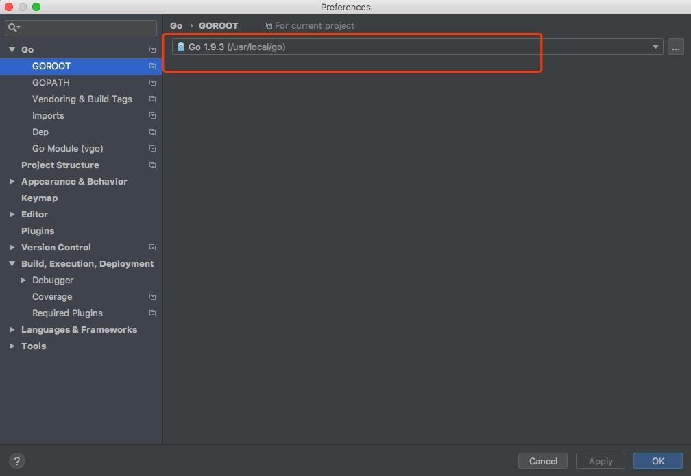
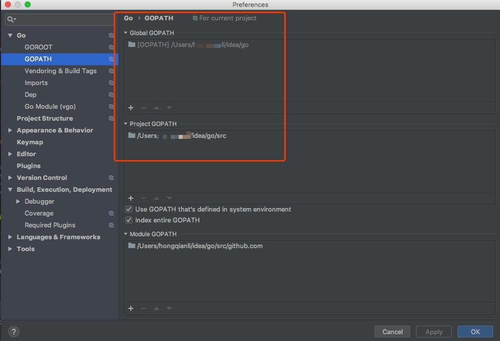
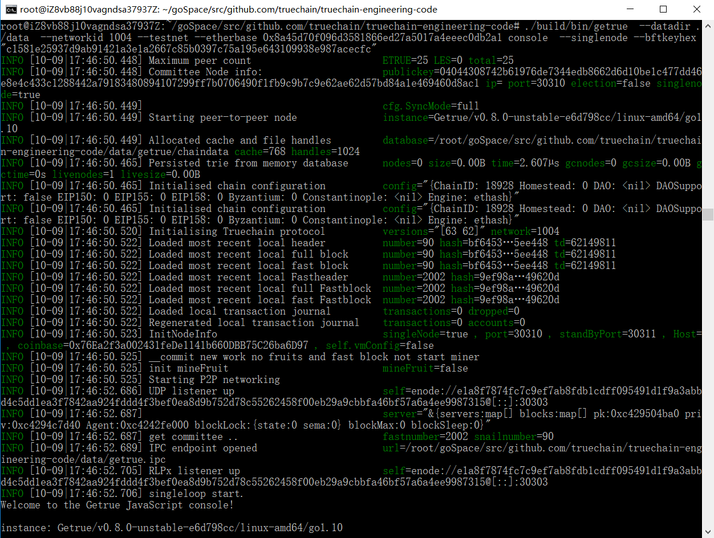
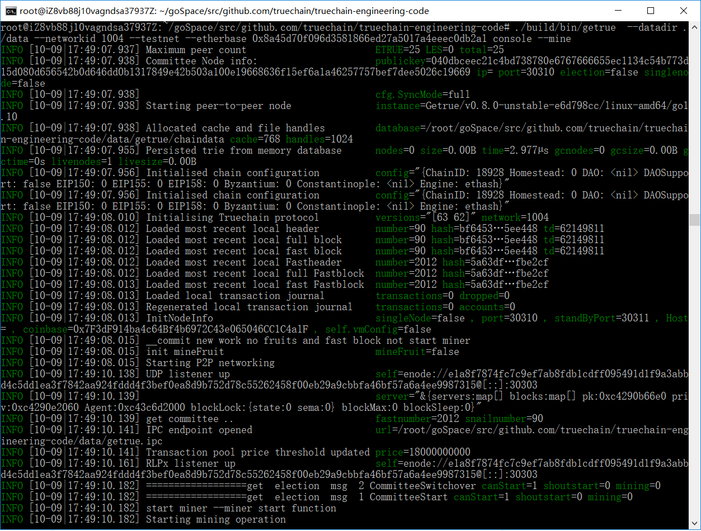
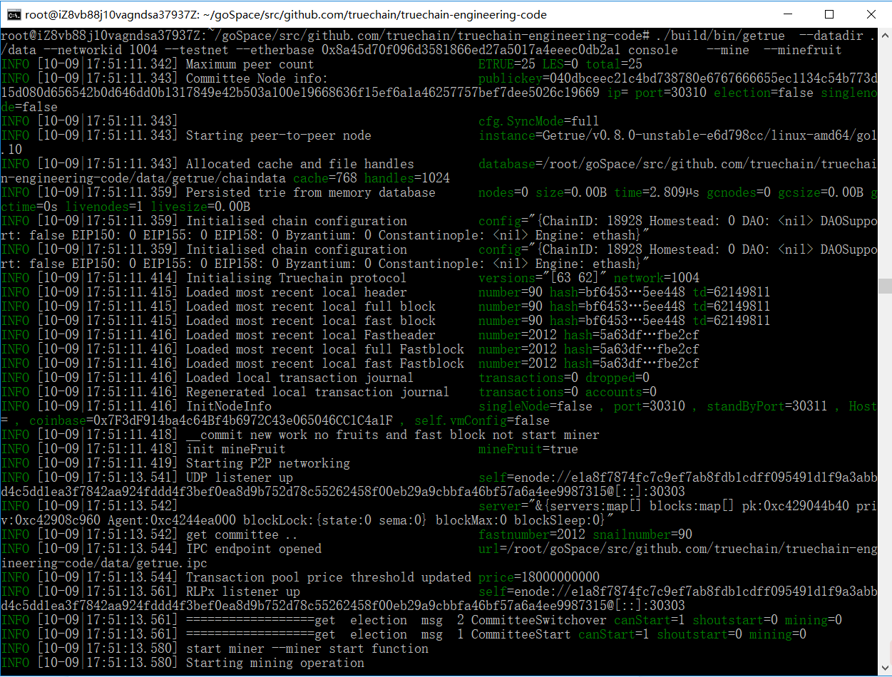
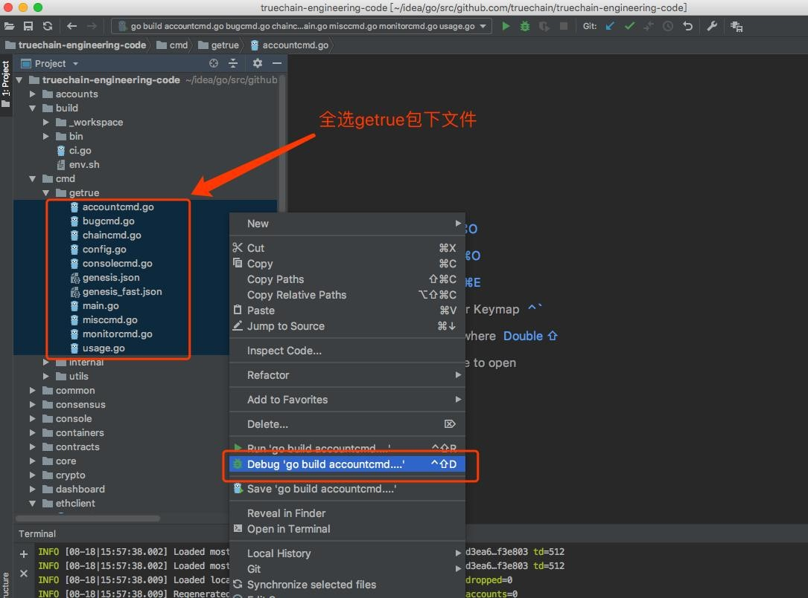
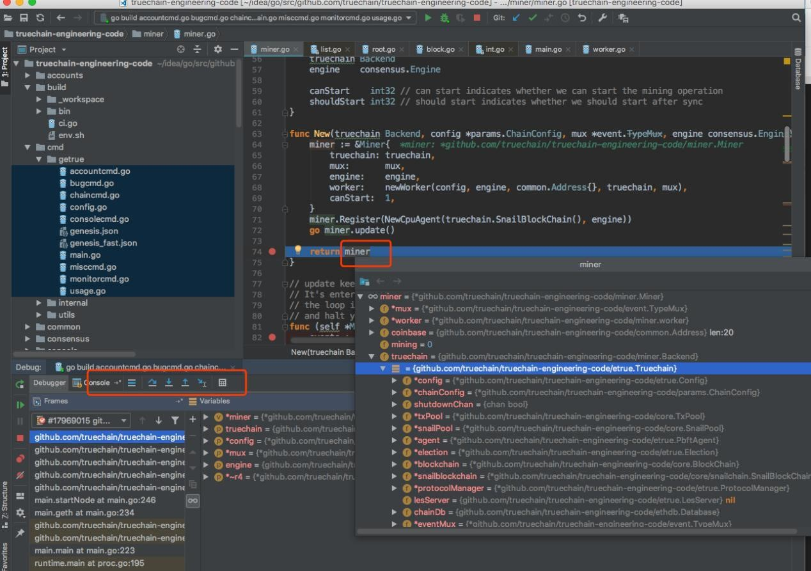

## TrueChian Development Practice : Debugging with IDE

Experiment Environment:  
*	macOS 10.13.6  
*	go version go1.9.3 darwin/amd6  
*	goland 2018.2.1  
*	truechain-fpow branch  

Clone the repository From Github:  
```
git clone -b fpow ow https://github.com/truechain/truechain-engineering-code.git 

```

Download GoLand Development IDE:

https://www.jetbrains.com/go/download  
PS: Please downloading the version which matches to your OS.you can get the 30-days trial or buy it.

GoLand Configuration:  



Environment Variable Configuration: **GOROOT**



### Import Code:

```
File >> Open ${ProjectPath}
```

### Compile:
```
$ make getrue 
```

PS: After “make” , the executable file of “geture” will generate at the path of “build/bin”

```
 ./build/bin/getrue  --datadir ./data  --networkid 1004 --testnet --etherbase 0x8a45d70f096d3581866ed27a5017a4eeec0db2a1 console  --singlenode --bftkeyhex "c1581e25937d9ab91421a3e1a2667c85b0397c75a195e643109938e987acecfc"
```

PS: start up a Committee Node to mine. more info about arguments are listed below:
```
--datadir ./data  =>  the path of our data to save
--networkid 1004  =>  network id. only the machines with the same network id can connected to each other
--singlenode      =>  this node is a single node

```



```
$./build/bin/getrue  --datadir ./data --networkid 1004 --testnet --etherbase 0x8a45d70f096d3581866ed27a5017a4eeec0db2a1 console --mine  
```

PS:  Start up a Snail Block Node to mine. The “block” and “fruit” are mined at the same.

  

```
$ ./build/bin/getrue  --datadir ./data --networkid 1004 --testnet --etherbase 0x8a45d70f096d3581866ed27a5017a4eeec0db2a1 console    --mine  --minefruit
```

ps: Start up a Snail Block Node to mine. The argument of “--minefruit” means only mining “fruit”.




### Debug Mining Code
----
  

PS: select all the files in getrue folder  

#### add a breakpoint in any line of the code, start debugging .
----
  


