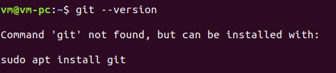
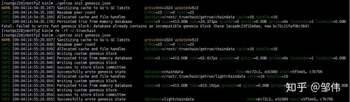

## TrueChain enviornment setup - Centos

#### Build TrueChain Cloud Runtime Environment

author: 邹伟  
reviewer: Paul  
----
This article is a supplement for the Environment Building.   
The CentOS environment is roughly the same as the Ubuntu environment with slightly differences.   
The environment uses Alibaba Cloud ECS cloud service construction, Users can quickly master the CentOS environment configuration.


#### System version: Cent 7.*  
* tools
*	Git
*	Go => version 1.7 or newer version
*	Compilation tool

### Install Git
Firstly, please check whether the system has installed Git.

```
$ git --version
```

When computer displays information like above, it indicates the Git hasn’t been installed;

Then, please use package-management tools to install Git as there is no specific requirement for Git version.

Finally, please check whether it is installed successfully after installation.

```
$ sudo apt-get install git
```

```
$ git --version
```
```
git version 2.17.1
```
When computer displays information like above, it indicates the Git  is installed successfully.

#### Install Go
Firstly, please check whether the system has installed Go.
```
$ go version
```
If Go is not installed, there are three methods to install it: package-management tool, official installation package and source code. Package-management tool is the most convenient, while official installation package is needed if the installed version is lower. As for installation procedure of using source code, please refer to official website of Go- Installing Go from source  [https://golang.org/doc/install/source](https://golang.org/doc/install/source)
Installing Go from source  [https://golang.org/doc/install/source](https://golang.org/doc/install/source)

**Install Package-management tool**
```
$ sudo apt-get install golang-go
```

**Using installation package**

We notice that the newest version 1.11 of Go will report runtime error when compiling truechain after testing, while the 1.10 version runs as usual. Therefore, the latter version is suggested. 

As for installation procedure, please refer to official website of Go -Getting Started  [https://golang.org/doc/install](https://golang.org/doc/install）

Firstly, please download installation package of Linux from official website of Go-Downloads  [https://golang.org/dl/](https://golang.org/dl/)  , which can only be downloaded through outer net.


**Other recommended download methods:**

* Baidu network backup link    [https://pan.baidu.com/s/15fJRHSItxlRfuM34X-xOXg](https://pan.baidu.com/s/15fJRHSItxlRfuM34X-xOXg)
password: 6n1r 
(It seems that large files can’t be downloaded with browser. Instead, they must be downloaded with client.)
* CSDN [https://download.csdn.net/download/great_cy_ang/10635720](https://download.csdn.net/download/great_cy_ang/10635720)
* Send e-mail to me:  cystone@aliyun.com


Install Go with command prompt
```
$ sudo tar -C /usr/local -xzf go$VERSION.$OS-$ARCH.tar.gz	
// Please ensure correct filename
```
### Set environment variables:
Firstly, create folders of GOPATH

```
# enter your current user directory
$ cd ~
# create go working directory
$ mkdir go
# open go working directory
$ cd go
# create bin, pkg and src folders in go working directory
$ mkdir bin pkg src

```
##### Configure the Go working directory (temporary environment variables)
Add commands as follows at the end of the $HOME/.profile
```
# execute the temporary environment variable scenarios directly
$ export PATH=$PATH:/usr/local/go/bin:$GOPATH/bin
# set working directory
$ export GOPATH=~/go

```

**Note** : Variables that are directly set using export are temporary variables, which means exiting the current shell and the values defined for variables will not take effective. How can we make the variables we define become permanently effective?

Configure the Go working directory（ configure environment variables permanently ）
```
# open the profile file to modify
$ vi /etc/profile
# add this configuration to the configuration file
export PATH=$PATH:/usr/local/go/bin:$GOPATH/bin
# configure working directory
export GOPATH=~/go
# Save the profile file and execute the following commands after the modification.It     does not need to be restarted.
$ source /etc/profile

```

Then using go version to see if the installation was successful.  
Testing whether the installation is successful：  
Writing the following code into `$HOME/go/src/hello/hello.go`

```
package main

import "fmt"

func main() {
	fmt.Printf("hello, world\n")
}
```
Then compile and test it:
```
$ cd $HOME/go/src/hello
$ go build
$ ./hello		// echo：hello,world
```

**Install compilation environment**

```
sudo yum groupinstall "Development Tools"
```

**Compile and Run TrueChain**
Method 1 (recommended): Use the following command to import the initial source code in the console.  
```
$ go get github.com/truechain/truechain-engineering-code
``` 

Then you will start downloading the source code, the source code will be downloaded to the previously configured GOPATH path.   
If an error is reported：fatal: unable to access [https://github.com/truechain/truechain-engineering-code/](https://github.com/truechain/truechain-engineering-code/)   
Peer reports incompatible or unsupported protocol version. It can be solved by the following command.
```
$ yum update -y nss curl libcurl
```

Method 2: Enter the $HOME/go/src/truechain directory. If there is no TrueChain directory, creating a mkdir truechain command to create it. Entering the TrueChain directory and execute the following command to clone the TrueChain project code.

```
$ git clone https://github.com/truechain/truechain-engineering-code.git
```

Enter the truechain-engineering-code directory after downloading through method one or method two：

```
make getrue	// only compile getrue
// or
make all	// compile all tools

```

Compiled successfully.  
The executable file which is compiled successfully is in the build/bin/ directory and running the corresponding file directly in this directory.

```
$ cd ./build/bin            // enter the compilation directory
```

In order to make the getrue command to run in any folder, the following operations are required.
```
$ cp getrue $GOPATH/bin    // copy the compiled file to the bin directory of $GOPATH
$ getrue init ../../cmd/getrue/genesis.json   // may report an error      also available in any directory                                         getrue init $GOPATH/src/github.com/truechain/truechain-engineering-code/cmd/getrue/genesis.json
$ ./getrue --nodiscover --singlenode --mine --etherbase 0x8a45d70f096d3581866ed27a5017a4eeec0db2a1 --bftkeyhex c1581e25937d9ab91421a3e1a2667c85b0397c75a195e643109938e987acecfc --bftip 192.1
68.68.43 --bftport 10080

```

Initializing genesis.json may give an error.  
**Fatal**: Failed to write fast genesis block: database already contains an incompatible genesis block   
(have 1acaa8c23f22e0ae, new bc72c21faf0bc5b9)

If this error occurs, deleting the TrueChain cache directory.  
```
$ rm -rf ~/.truechain
```

Initialization and operation are successful. As shown below:

  

Which indicates the Initialization is successful.