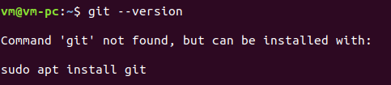

## Installation - How to get and install TrueChain

### TrueChain Development Preparation- Building Environment for Ubuntu Users

#### Example: System Version: Ubuntu 18.04

#### Note: 
* Installation procedure varies slightly due to different version of Linux. When CentOS，RHEL are installed, please use “yum” to replace “apt-get”. 

* As the version of Ubuntu used in this tutorial is newer, the Installation procedure may vary slightly with lower version of Ubuntu.

#### Tools needed:
*	Git
*	Go => version 1.7 or newer version
*	Compilation tool

### Install Git
Firstly, please check whether the system has installed Git.

```
$ git --version
```

When computer displays information like above, it indicates the Git hasn’t been installed;

Then, please use package-management tools to install Git as there is no specific requirement for Git version.

Finally, please check whether it is installed successfully after installation.

```
$ sudo apt-get install git
```

最后，安装完成后，检查是否安装成功
```
$ git --version
```
```
git version 2.17.1
```
When computer displays information like above, it indicates the Git  is installed successfully.

#### Install Go
Firstly, please check whether the system has installed Go.
```
$ go version
```
If Go is not installed, there are three methods to install it: package-management tool, official installation package and source code. Package-management tool is the most convenient, while official installation package is needed if the installed version is lower. As for installation procedure of using source code, please refer to official website of Go- Installing Go from source  [https://golang.org/doc/install/source](https://golang.org/doc/install/source)
Installing Go from source  [https://golang.org/doc/install/source](https://golang.org/doc/install/source)

**Install Package-management tool**
```
$ sudo apt-get install golang-go
```

**Using installation package**

We notice that the newest version 1.11 of Go will report runtime error when compiling truechain after testing, while the 1.10 version runs as usual. Therefore, the latter version is suggested. 

As for installation procedure, please refer to official website of Go -Getting Started  [https://golang.org/doc/install](https://golang.org/doc/install）

Firstly, please download installation package of Linux from official website of Go-Downloads  [https://golang.org/dl/](https://golang.org/dl/)  , which can only be downloaded through outer net.


**Other recommended download methods:**

* Baidu network backup link    [https://pan.baidu.com/s/15fJRHSItxlRfuM34X-xOXg](https://pan.baidu.com/s/15fJRHSItxlRfuM34X-xOXg)
password: 6n1r 
(It seems that large files can’t be downloaded with browser. Instead, they must be downloaded with client.)
* CSDN [https://download.csdn.net/download/great_cy_ang/10635720](https://download.csdn.net/download/great_cy_ang/10635720)
* Send e-mail to me:  cystone@aliyun.com


Install Go with command prompt
```
$ sudo tar -C /usr/local -xzf go$VERSION.$OS-$ARCH.tar.gz	
// Please ensure correct filename
```
Set environment variables:
Firstly, create folders of GOPATH

```
$ cd ~
$ mkdir go
$ cd go
$ mkdir bin pkg src
```

Add commands as follows at the end of the $HOME/.profile
```
export GOPATH=$HOME/go
export PATH=$PATH:/usr/local/go/bin:$GOPATH/bin
```

Then run following commands to make it valid
```
$ source $HOME/.profile
```

Then check whether it is installed successfully by using Go version.
Test if it is is installed successfully:
Write following codes into `$HOME/go/src/hello/hello.go`
```
package main

import "fmt"

func main() {
	fmt.Printf("hello, world\n")
}
```
Then compile and test it:
```
$ cd $HOME/go/src/hello
$ go build
$ ./hello		// echo：hello,world
```

**Install compilation environment**

```
$ sudo apt-get install build-essential
```

**Compile and test TrueChain**
Enter a catalogue you like, such as $GOPATH/src/, and operate run following commands:
```
$ make getrue	// only compile getrue

OR

$ make all	// compile all tools

```
Enter a catalogue you like, such as $GOPATH/src/, and operate run following commands:
```
$ git clone https://github.com/truechain/truechain-engineering-code.git
```

Enter truechain-engineering-code after download:
Executable file is stored in build/bin/ catalogue after successful compilation, and you only need to run corresponding files under the catalogue.
Following steps need to be taken to make getrue commands valid in any file:
```
$ cp path/to/getrue $GOPATH/bin
```

Code into genesis.json as follows:
```
{
  "config": {
        "chainId": 10,
        "homesteadBlock": 0,
        "eip155Block": 0,
        "eip158Block": 0
    },
  "alloc" : {
	  "0x970e8128ab834e8eac17ab8e3812f010678cf791" :
      { "balance" : 90000000000000000000000},
	  "0x68f2517b6c597ede0ae7c0559cdd4a84fd08c928" : 
      { "balance" : 10000000000000000000000}
  },
  "coinbase"   : "0x0000000000000000000000000000000000000000",
  "difficulty" : "0x200",
  "extraData"  : "",
  "gasLimit"   : "0x2fefd8",
  "nonce"      : "0x0000000000000042",
  "mixhash"    : 
  "0x0000000000000000000000000000000000000000000000000000000000000000",
  "parentHash" : 
  "0x0000000000000000000000000000000000000000000000000000000000000000",
  "timestamp"  : "0x00"
}

```

Then run them.
```
$ getrue init path/to/genesis.json
$ getrue --nodiscover --mine 
--etherbase=0x8a45d70f096d3581866ed27a5017a4eeec0db2a1

```

If initialization and operation is done, screen displays like this:


### FAQ
----
Report an error of initialization: Fatal: Failed to write fast genesis block: database already contains an incompatible genesis block (have 1acaa8c23f22e0ae, new bc72c21faf0bc5b9)


Resolution：
```
$ rm -rf ~/.truechain
```

#### IDE

Both of Goland and Visual Studio Code have downloaded Linux. As to specific installation procedure, please refer to following two articles:

* Environment setup of Apple’s system  [https://github.com/truechain/wiki/blob/master/developer/1.mac_env_build.md](https://github.com/truechain/wiki/blob/master/developer/1.mac_env_build.md)
* Environment setup of Windows [https://github.com/truechain/wiki/blob/master/developer/2.window_env_build.md](https://github.com/truechain/wiki/blob/master/developer/2.window_env_build.md)


The compiler I use in the development process is Vim, and I will introduce how to configurate Vim into a powerful development tool in the article-- Preparation Period of Developing Truechain – Environment Setup (Vim)