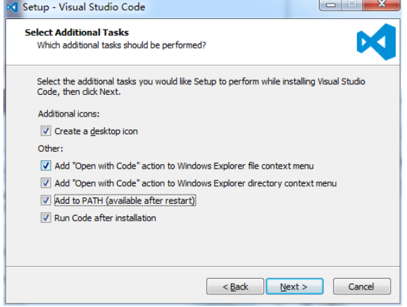

## Setting up the TrueChain develop environment on windows system


The truechain develop environment supports Windows\MacOS\Linux,   
This article provides a detailed description of the develop environment on the Windows system.


#### Needed environment 
1. Operating system environment `Windows 10 Professional version`

2. Golang environment
####step1 - Download and install Golang

It is required to download and install the 1.7+ version of golang.   
Below is the Golang V1.10.3 latest of official download address:
[https://dl.google.com/go/go1.10.3.windows-amd64.msi](https://dl.google.com/go/go1.10.3.windows-amd64.msi)

Or you can download it from Baidu cloud disk behind the download link for Windwos 32 system:  
[https://pan.baidu.com/share/init?surl=_uR-rEiOwDYPYcHwLCBZwA](https://pan.baidu.com/share/init?surl=_uR-rEiOwDYPYcHwLCBZwA) ,   
password: qdyg

Download link for Windwos 64 system :  
[https://pan.baidu.com/s/1mKeVZ9mWVcWUE0JJeaQ40w](https://pan.baidu.com/s/1mKeVZ9mWVcWUE0JJeaQ40w)  password: s91q

Choose a version that matches your system. For example, in this article, go1.10.3.windows-amd64.msi,is downloaded. 

Double click on the file to install. Please select the installation path in your system. For example, my installation path is **E:\Go**

#### step2 - Configuring the Golang environment

1.	If you install the golang program by mis , the Go environment settings will be set automatically.   
2.	If you install the golang program by other installation package, please check the configuration of the environment variables, as follows:
```
step1: variable name: GOPATH   value:E:\go      
step2: variable name: GOBIN    value:E:\go\bin   
step3: variable name: GOARCH   value:386   
step4: variable name: GOOS    value:windows   
step5: variable name: GOROOT   value:E:\go   
step6: edit the Path and add %GOBIN% at the end of the variable value of Path
```
3.	Verify that the Go installation environment is set successfully
Open a command prompt in Windows then execute the command: 
go version

if output is:
go version go1.10.3 windows/amd64

It is successful. Otherwise, if output is:
go is not an internal or external command, nor is it a runnable program or batch file

Then please refer to "Configuring the Golang environment" to reset it until the verification is successful.

#### step3 - Install Git

Choose the latest Git download:

git-2.18.0-32-bit.exe Download link for Windwos 32 system:  
https://github.com/git-for-windows/git/releases/download/v2.18.0.windows.1/Git-2.18.0-64-bit.exe

git-2.18.0-64-bit.exe Download link for Windwos 64 system:  
https://github.com/git-for-windows/git/releases/download/v2.18.0.windows.1/Git-2.18.0-64-bit.exe 

When download is completed, double-click to install. For example, you can use:  
**64-bit git-2.18.0-64-bit.exe**

You can choose the installation path. For example, in my system, the installation path is:   
**E:\Program Files\Git**

Then find the git-bash.exe file below the path, Double click then will open a MinGW64 command window. execute the command  
**git –version**
If version information is printed, then the installation is successful.

#### step4 - Install the GCC compiler

If you want to compile True chain code on windows, we need install a MinGW compiler, the compiler download link is:  
[https://sourceforge.net/projects/mingw-w64/files/latest/download](https://sourceforge.net/projects/mingw-w64/files/latest/download)

After the download is complete, double-click to install. For example, the 64-bit system installation configuration is as follows:  
 
Select the custom installation path, I installed it under the **E:\mingw-w64\ directory**. 

Next, the installation may take a few minutes and wait patiently for the installation to complete.

After successful installation, set the environment variable compiled by the environment gcc, for example, install `E:\mingw-w64`, add `E:\mingw-w64\mingw64\bin` to the last side of the path, and execute
```
gcc –v
```  
in cmd after completion. If version is displayed, then the installation is successful.

Possible problems: when you download mingw-w64-install.exe, the following problems occur in the online installation: `Cannot download repository.txt[0]`.

   Solution: Visit:
[http://sourceforge.net/p/mingw-w64/mailman/message/32967954/](http://sourceforge.net/p/mingw-w64/mailman/message/32967954/) link to download the properly configured MinGW64 file library and place it in the `C:\MinGW` directory.

#### step5 - Install IDE Visual Studio Code
It is recommended to use Visual Studio Code,   
the download address is: https://code.visualstudio.com/Download (depending on your own system is 32bit or 64bit).  
For example, I choose 64-bit download, The installation steps are as follows:

  

  

  

  

  


After launching the Visual Studio, it looks like:

 


Next is to install the VS Code Go plugin.

Most plugins can be installed automatically,   
but there may be some Go plugin installation failures.   
To resolve possible installation failures,you need to manually download the plugin source code and install it by `go get` command. 

Once the IDE is installed successfully, you can start VS Code and then write a sample of hello.go.   
When the IDE will recommend the relevant plugin that needs to install Go,   
select “Install all” in the left sidebar, there is an "Extension" menu,   
checked, and enter "Go" in the "Extended" menu to search, as shown below, showing that the Go plugin is being installed.

 


View plugin installation details, select the "Output" option

 

After waiting for all installations to complete, maybe some will fail, as shown in the following figure:


Due to the installation failure, you need to manually download and install it. two download options to choice:  
1. Download by cloud disk (no VPN, unzip the file, the path is below ..\GOPATH\go\src\)link:  
[https://pan.baidu.com/s/1ucGJQF3ha3P0u1gl6BmciQ](https://pan.baidu.com/s/1ucGJQF3ha3P0u1gl6BmciQ)  password：zfz5

Official download:  
Step1: In the %GOPATH%\src\ directory, create the golang.org folder and create a new x folder. The directory is "%GOPATH\src\golang.org\x"
Step2: Cd x folder and Start downloading the plugin package: `git clone https://github.com/golang/tools.git tools`,   
then will generate tools folder

Because Gopkgs has goint two plugins not installed successfully

I use the cmd console to find the GoPath installation directory of the previous environment variable configuration. My directory is C:\Users\Administrator\go, manually download the source file and put it in the corresponding directory.   
The operation is as follows:

```
git clone https://github.com/uudashr/gopkgs.git
go get -u github.com/gopkgs/cmd/gopkgs
git clone https://github.com/golang/lint.git 

```

Then copy the “..\github.com\lint” directory and all the files below to “..\golang.org\x\lint” (because the default installation path for lint is .\golang.org\x\lint, so you need to copy)
```
    go get -u github.com/lint/golint
```

If there is no error, it means that the two plug-ins that failed the automatic installation are successfully installed by manually. Check the `$GoPath\bin` directory,   
if the file is installed, as shown:

 

  

Next, you can restart vscode IDE when the basic go related plug-in installation is completed.   
If you need to install other plug-ins, please refer to the above method to automatically and manually install it. Press F5 to run the Hello.go program.

Because the automatic installation successfully installs the debugging tool plug-in Dlv,   
you can also pass Breakpoint debugging program, as shown

  

Congratulations, the IDE's Go development configuration is complete.

#### step6 - TrueChain Code download and compilation
TrueChain development code download:
Solution 1(recommended): 
Enter the command in the command window:   
go get github.com/truechain/truechain-engineering-code  
Then the source code will be downloaded, the source code will be downloaded to the previously configured GOPATH path.

Solution 2:
First open the windows command window, go to the following directory:  
`$GOPATH\src\ `  
for example, my $GOPATH is `C:\Users\Administrator\go`,Then use the command   
`cd C:\Users\Administrator\go\src\github.com`  
Create a new truechain directory, then download the latest true chain project code from the command.
   
The command is as follows: 
```
git clone https://github.com/truechain/truechain-engineering-code.git
	100% progress display means the download is complete.
```

##### TrueChain Code compilation
Currently recommended to use VS Code IDE for development, first open the VS Code IDE,   
select "File" - "Open folder",   
the folder path select the truechain path, such as: `C:\Users\Administrator\go\src\github.com\truechain`

The first step, the True Chain project initialization parameter modification:   
first find the entry of the True chain project code program,   
the file path is in "..\cmd\getrue\main.go", press "F5" to start compiling,   
the first time will prompt whether Open "launch.json", select Open, as shown below:

   

Modify the lanuch.json code as follows:

 

We also need to change the value of the "showLog" parameter to true. After configuring the parameters,   
open the ../cmd/getrue/main.go file then press “F5” to run. If there is no problem, the initialization will be successful.

The second step, mining parameter configuration: the same is to modify launch.json, --nodiscover is used to ensure private chain.

【lanuch.json】   
```
...
            
 "args": ["--nodiscover", "--singlenode", "--mine", "--etherbase", "0x8a45d70f096d3581866ed27a5017a4eeec0db2a1", "--bftkeyhex", "c1581e25937d9ab91421a3e1a2667c85b0397c75a195e643109938e987acecfc", "--bftip", "192.168.68.43", "--bftport", "10080"],  // only need change here
  ...

```

The third step, manually download some of the dependent library files and then compile:

  	Press "F5" to run, there may be an error, open the "debug console", check the error,   
	I have encountered "gosigar" this dependency library download failed.   
	Need to manually download and install, the solution is as follows, perform the following operations:

```
git clone https://github.com/golang/sys.git $GOPATH/src/github.com/golang/sys  
```

The default path for gosigar installation is at ..src/golang.org/x/sys, so the files downloaded by clone should be assigned to this directory.
`go get -u github.com/elastic/gosigar`

According to the above operation, there is no other error, it will run normally,   
see the current running state in the console, and finally, start the development of True Chain with pleasure!!


### step7 - Installing IDE Goland

Before downloading Goland installation, you need to determine the configuration of Go and Go environment variables.   
Gcc has been installed and configured. If not, refer to the previous section.

IDE Goland download and installation  
Goland download address : [https://www.jetbrains.com/go/download/#section=windows](https://www.jetbrains.com/go/download/#section=windows)

Select windows to download, double-click goland-2018.2.1.exe to install, always click next, if you need to create a desktop shortcut, you can check it until the installation is complete. Refer to the following:


 

 

IDE Goland configuration

Double-click to start Goland, start for the first time, no need to configure Setting,   
default select the “Do not import setting”, select OK, then protocol, scroll to the bottom, click Accept to complete.

 

Then the Data Sharing window will appear, select Not Send and then go to the next step, because we choose to use the 30-day for free, If you want to use it permanently, you need to purchase the license activation, then choose the following:


Going to Goland's main interface

After installation, you first need to set up some configurations. The most important of these are the two parameters "GOROOT" and "GOPATH". "GOROOT" indicates the installation location of GO on your computer. This is usually installed directly into the environment variable when installing, and "GOPATH" is your working path. It can contain multiple Go source code. The path to the file, package file, and executable file, and these paths must contain three specified directories: src, pkg, and bin, which are used to store source files, package files, and executable files.

Import of Truechain code project  
If you don't have the development project code for Truechain, download the code by using the command   
`git clone https://github.com/truechain/truechain-engineering-code.git `  
then put the downloaded code under $GOPATH\src\github.com\truechain\

I have downloaded the Truechain project code, open it directly through Open Project,   
select the truechain-engineering-code folder, and click OK.     
The first time you import a project, you need to wait patiently for a while.  


Code compilation

First find the location of the True Chain project code in "..\cmd\getrue", select and click the right button to run


The solution is as follows: `Open Run--Edit Configuration`, add the following parameters to Program arguments:` --datadir ./data init ./truechain-engineering-code/cmd/getrue/genesis.json` as shown below:  


After configuring the parameters, run “..\cmd\getrue\” again.   
When the following prompt appears, it means that the creation of the creation block is successful.  


**Note**:   
You can also download the truechain code and dependent library files as well as some installation packages by Baidu cloud disk,   
link: [https://pan.baidu.com/s/1ucGJQF3ha3P0u1gl6BmciQ](https://pan.baidu.com/s/1ucGJQF3ha3P0u1gl6BmciQ) password: zfz5
