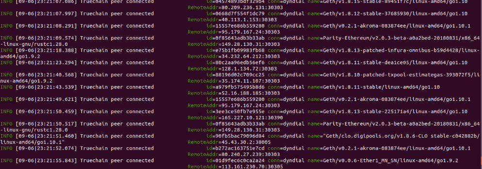

## Truechain main network setup tutorial

system version：Ubuntu 18.04
Required environment：  
1. Git
2. Go => version 1.7 +
3. Compilation tools

### Install Git:   
`$ sudo apt-get install git`

### Install Golang:  
`$ sudo apt-get install golang-go`

Now let’s set the environment variable. Firstly, you need to create the GOPATH folder

```bash
$ cd ~
$ mkdir go
$ cd go
$ mkdir bin pkg src
```

Add the following command at the end of the ‘$HOME/.profile’ file

```bash
export GOPATH=$HOME/go
export PATH=$PATH:/usr/local/go/bin:$GOPATH/bin
```

Then run the following command
```bash
$ source $HOME/.profile
```
Now it is time to check whether test installation is successful by following:

First, write the following code to **$HOME/go/src/hello/hello.go**

```go
package main
import "fmt"
func main() {
fmt.Printf("hello, world\n")
}
```

Then compile and run:
```bash
$ cd $HOME/go/src/hello
$ go build
$ ./hello		// print：hello,world
```

If the expected output “hello, world” appears, congratulations!

### Install the build environment  
```bash
$ sudo apt-get install build-essential
```

### Compile TrueChain  
Go to a directory of your choice, such as $GOPATH/src/ and run the following command

```bash
$ cd $GOPATH/src/
$ git clone https://github.com/truechain/truechain-engineering-code.git
```
After the download is completed, go to the truechain-engineering-code directory:

```bash
$ make getrue    // Only compile getrue
or
$ make all    // Compile all tools
```
After the compiled executable file is ready in the build/bin/ directory, execute the following command to view the getrue version information.

```bash
$ ./getrue version
```
In order for the getrue command to run in any folder, the following operations are required (path is the directory where getrue located)

```bash
$ cp path/getrue $GOPATH/bin
```
If you have any questions about the above installation process, please refer to the Ubuntu environment (Link: [https://github.com/truechain/wiki/blob/master/developer/3-1.Ubuntu_env_build.md](https://github.com/truechain/wiki/blob/master/developer/3-1.Ubuntu_env_build.md)

### Running the main chain

Run the following command to start to connect to other peers and then automatically sync the blocks:
```
 ./build/bin/getrue  --datadir ./data  --cache 4096 --rpc --rpcport 33333 --rpcaddr 0.0.0.0
```
**Note:** The parameters are added according to your personal situation. Running getrue --datadir path/data can also be running.

Please find below explanation for several parameters in the command:

*  --datadir "xxxx": Specify data directory and used to store blockchain data, status data, keystore data and soon. This directory takes up a lot of space, and the specified directory must have enough disk space.  
*  --cache value: The amount of memory MB allocated to the internal cache, the default is 128, we have to set a larger size, at least 1024, because this value can improve the efficiency of data synchronization.  
* --rpc: Enable HTTP-RPC server  
* --rpcaddr : HTTP-RPC Server interface address(Default: "localhost"), By default only local connections are allowed, set to 0.0.0.0 can receive connection requests from any address  
* --rpcport : HTTP-RPC server listening port (default: 8545), can be changed to a different port

It looks like this when it runs:



Automatically sync blocks after a while
Then go through a long wait, and when the block synchronization is complete, the node can receive the transaction request.

references:  [https://www.jianshu.com/p/719a34fe484d](https://www.jianshu.com/p/719a34fe484d)
