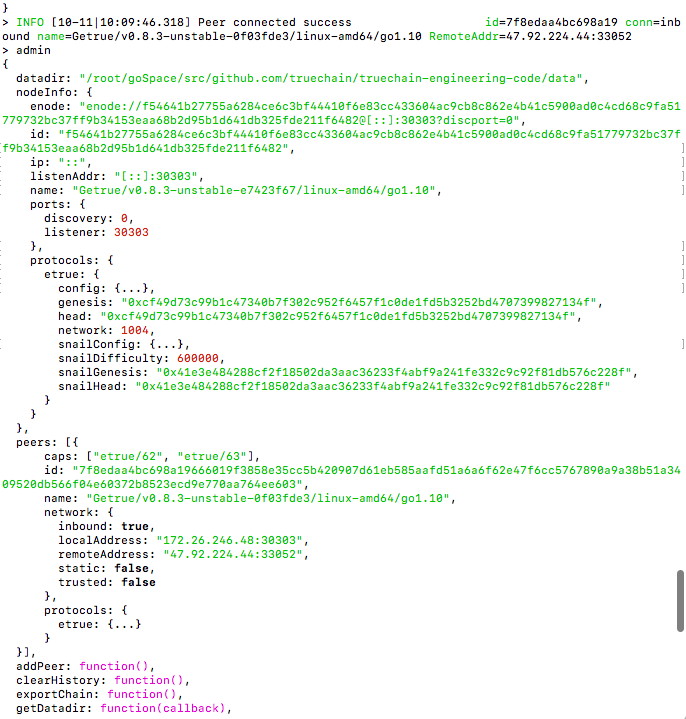

# TrueChain Tutorials - Testing Network Setup

This tutorial provides an introduction to TrueChain testing network setup. It demonstrates how to build, run, and connect to the network. 

## System requirements
**Note: this article use OSX system**

1. golang
2. gcc

### Step 1
install gcc & golang

```
brew install gcc golang
```
### Step 2
set golang environment

* GOPATH
* GOROOT

```
echo "GOPATH=your_working_dir" >> .bash_profile
echo "GOROOT=go_install_dir>" >> .bash_profile
```

now, let's check whether we can correctly set the environments:

```
go env
```
you can check `GOPATH` value if it's correct:


## Build TrueChain Project

1. get the TrueChain source code

in your working dir， run this command

```
go get https://github.com/truechain/truechain-engineering-code
```

2. build it

 go to **truechain-engineering-code** directory

```
make getrue
```

after compilation, the path of the Getrue command is `YOUR_TRUECHAIN_PROJECT_DIR`/build/bin/. Refer to the diagram below:


### The getrue command
run geture --help to get the manual.

```
geture --help
```


## Deploy TrueChain Test Network
Step 1. Create an Test Directory like `Test`

Step 2. Copy genesis.json file from cmd/getrue , the content of the file as follows.

```
{
  "config": {
        "chainId": 10,
        "homesteadBlock": 0,
        "eip155Block": 0,
        "eip158Block": 0
    },
  "alloc"      : {
	  "0x970e8128ab834e8eac17ab8e3812f010678cf791" : { "balance" : "90000000000000000000000"},
	  "0x68f2517b6c597ede0ae7c0559cdd4a84fd08c928" : { "balance" : "10000000000000000000000"}
	  },
  "coinbase"   : "0x0000000000000000000000000000000000000000",
  "difficulty" : "0x200",
  "extraData"  : "",
  "gasLimit"   : "0x2fefd8",
  "nonce"      : "0x0000000000000042",
  "mixhash"    : "0x0000000000000000000000000000000000000000000000000000000000000000",
  "parentHash" : "0x0000000000000000000000000000000000000000000000000000000000000000",
  "timestamp"  : "0x00"
}
```
Step 3. Create genesis blocks. Execute the following command

```
getrue --datadir Test init path/to/cmd/getrue/genesis.json
```

parameter --datadir,Used to specify a directory.After the above command is executed, will generate two folders, **getrue** and **keystore**, The **getrue** folder is used to store the relevant data of the chain, and the user information of the chain is stored in the **keystore** folder as shown in the figure.

Step 4. Start the test chain start node. Execute the following command: 

```
getrue --datadir Test --nodiscover console
```

After starting successfully, as shown in the following figure


##Useage

### Step 1. Create a new account

```
> personal.newAccount()
Passphrase: 
Repeat passphrase: 
"0xce0f1ee66b1695e33d5e8cb9dd79525764d68a48"
> 
```

Enter the password twice and create a new account. Next, you can view the account

```
> etrue.accounts
["0xce0f1ee66b1695e33d5e8cb9dd79525764d68a48"]
> 
```

### Step2. Query account balance

```
> etrue.getBalance(etrue.accounts[0])
0
> 
```

### Step3. Start mining
```
miner.start(1)
INFO [09-02|23:42:27.187] Updated mining threads                   threads=1
INFO [09-02|23:42:27.188] Transaction pool price threshold updated price=18000000000
INFO [09-02|23:42:27.188] Etherbase automatically configured       address=0xCE0F1EE66B1695E33D5e8cb9Dd79525764D68A48
INFO [09-02|23:42:27.188] Starting mining operation 
null
```
 
### Stop mining

```
miner.stop
```
## Add additional nodes to the test network

### Step1. start separately 

1.Committee node startup parameter

```
./build/bin/getrue --datadir ./data --networkid 1004 --testnet --etherbase 0x8a45d70f096d3581866ed27a5017a4eeec0db2a1 console --singlenode --nodiscover --bftkeyhex "c1581e25937d9ab91421a3e1a2667c85b0397c75a195e643109938e987acecfc"
```

2.Mining block startup parameters

```
./build/bin/getrue --datadir ./data --networkid 1004 --testnet --nodiscover --etherbase 0x8a45d70f096d3581866ed27a5017a4eeec0db2a1 console --mine
```

3.Mining fruit start parameter

```
./build/bin/getrue --datadir ./data --networkid 1004 --testnet --nodiscover --etherbase 0x8a45d70f096d3581866ed27a5017a4eeec0db2a1 console --mine --minefruit
```

### Step2. In other machines, use admin.nodeInfo.enode to get enode information.

```
admin.nodeInfo.enode "enode://35184ea5262987880b3a97a38a0678e32d279a9438770940293f181f4790738011f93401f91ba6f6a51804fd1a76a47f45c991a88661c7207513e5d7a8a73318@[::]:30303?discport=0"
```

### Step3. The ip address and enode information of other host nodes must be filled  when you call admin.addPeer () in own node console so that the nodes of other hosts can be connected.

```
admin.addPeer("enode://35184ea5262987880b3a97a38a0678e32d279a9438770940293f181f4790738011f93401f91ba6f6a51804fd1a76a47f45c991a88661c7207513e5d7a8a73318@[47.92.224.44]:30303?discport=0")
```

### Step4. Test whether the two nodes are connected successfully as shown in figure

### Step5. After a successful connection between two nodes, the next two nodes will automatically synchronize the transaction as shown in the figure


