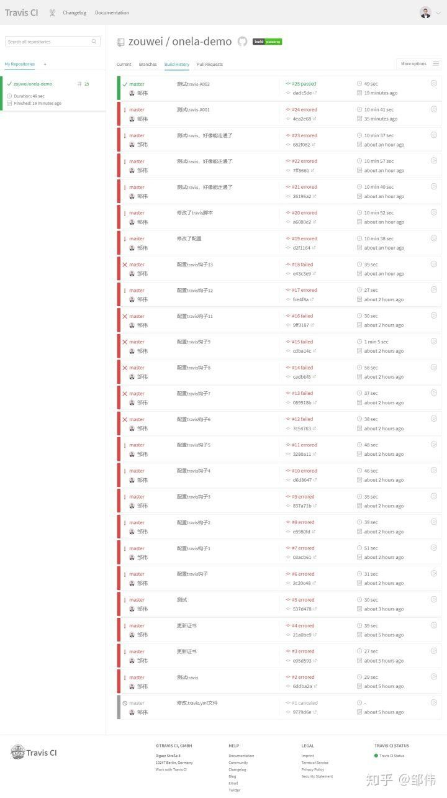

## TrueChain Continuous Integration (Travis-CI)

Recently, I have been studying TrueChain on GitHub. Fortunately, I have the chance to participate in the project and fully understood technical detail about the blockchain. The Continuous Integration (CI) have highly extendable, and able to implement automatic test and deployment for different program language project, which make our project more efficient and also will help project management. There are have a lot of solutions in CI, such as Jenkins, Travis-CI, and so on. We choose Travis-CI here, as Travis-CI is closely combined with GitHub, and Travis-CI only supports GitHub projects, so most of GitHub project choose Travis-CI solution.

Author: zouwei

Environments Prepare
* GitHub public project(Travis is free for open source projects, and charge for private projects)
* Linux Server (ECS cloud server, CentOS 7.4 System)
* Terminal connect tool(XShell)

Automatic Deployment Flow
1. Modify local code and commit to specific branch;
2. Travis listen on the repository;
3. Travis performs install and scripts task (e.g some dependencies and test build commands for installation test build tasks)
4. SSH without password login to the server when the task execute successful(will callback after_success)
5. Automatic performs the configure scripts in server
6. Complete the automatic deploy

Project Configuration in Travis
The aim of CI is that,when we need to release a project, and push to the master branch, Travis will deploy it automatically.
Create GitHub repository and complete the initialization of the project. If there is already a project, you can start the deployment directly. As of I created onela-demo project before, so I take it as an example.

Activate the Repository in Travis
Log into Travis-CI with GitHub accounts. Travis-CI will synchronize all repositories information on your GitHub. All your repositories will be listed after logging in:


The project not activated by default, click the activation button to activate.

SSH connect the server

```bash
#Create new account，e.g create account www
useradd www
#change password（it not be demand, but you’d better do it to avoid login require password in the future.）, follow the instructions to set the password。
passwd www
# Add add permissions for the user
vim /etc/sudoers

Find out "#Allow root to run any commands anywhere " in file /etc/sudoers, and add a new line as below:
www    ALL=(ALL)   ALL

[root@trend ~]# su www
[www@trend root]$ cd ~
[www@trend ~]$ ssh-keygen -t rsa
Generating public/private rsa key pair.
Enter file in which to save the key (/home/www/.ssh/id_rsa): 
Created directory '/home/www/.ssh'.
Enter passphrase (empty for no passphrase): 
Enter same passphrase again: 
Your identification has been saved in /home/www/.ssh/id_rsa.
Your public key has been saved in /home/www/.ssh/id_rsa.pub.
The key fingerprint is:
f1:ed:a6:ce:c0:88:13:f2:b9:a8:07:0b:f2:68:06:a1 www@trend
The key's randomart image is:
+--[ RSA 2048]----+
|                 |
|                 |
|        .        |
|.        o .     |
|... .   S . .    |
|E  o + o   .     |
|+=  = . o   o    |
|ooo. o   o o     |
|+o. .    .+      |
+-----------------+
[www@trend ~]$ 
```

You can find that the key pair generated in the user’s home directory .ssh folder. (/home/www/.ssh).

The Linux OS has permission control rule, so you need to set the file permission appropriate. Here I grant**.ssh directory permissions to 700, and grant **.ssh directory files permissions as 600.

```bash
[www@trend ~]$ chmod 700 ~/.ssh/
[www@trend ~]$ chmod 600 ~/.ssh/*
[www@trend ~]$ ls -al
total 24
drwx------  3 www www 4096 Sep  7 13:55 .
drwxr-xr-x. 5 root   root   4096 Sep  7 11:45 ..
-rw-r--r--  1 www www 18 Dec  7  2016 .bash_logout
-rw-r--r--  1 www www 193 Dec  7  2016 .bash_profile
-rw-r--r--  1 www www 231 Dec  7  2016 .bashrc
drwx------  2 www www 4096 Sep  7 13:55 .ssh
[www@trend ~]$ ls ~/.ssh/ -al
total 16
drwx------ 2 www  www 4096 Sep  7 13:55 .
drwx------ 3 www www 4096 Sep  7 13:55 ..
-rw------- 1 www www 1675 Sep  7 13:55 id_rsa
-rw------- 1 www www 394 Sep  7 13:55 id_rsa.pub
[www@trend ~]$ 
```

Add generated public key to authorized keys (import)
```bash
[www@trend ~]$ cd .ssh/
[www@trend .ssh]$ ls
id_rsa  id_rsa.pub
# output the public key content to authorized_keys
[www@trend .ssh]$ cat id_rsa.pub >> authorized_keys
[www@trend .ssh]$ cat authorized_keys
ssh-rsa AAAAB3NzaC1yc****************************************************************  www@trend
```

Create new config file
```bash
Host test
HostName 99.99.99.99(Your server IP address)
#The login username
User www
IdentitiesOnly yes
#The login private key
IdentityFile ~/.ssh/id_rsa
```

Test SSH login 

```bash
# ssh login test
[www@trend .ssh]$ ssh test
Last login: Sun Sep  9 18:51:57 2018

Welcome to Alibaba Cloud Elastic Compute Service !
```

If login fail with error: " Permission denied (publickey,gssapi-keyex,gssapi-with-mic) ". Please refer to following operation：

```bash
# modify sshd_config configuration file
vim /etc/ssh/sshd_config
# Modify the following content

RSAAuthentication yes 
PubkeyAuthentication yes # set RSAAuthentication & PubkeyAuthentication as "yes" to enable public-key model
AuthorizedKeysFile .ssh/authorized_keys # configure the public-key file
PasswordAuthentication yes # open password authentication mode

# save sshd_config file and restart ssh service
/bin/systemctl restart sshd.service

```

### Install the Travis client tool on the Linux server  
Travis can manually install, but the dependency package is a trouble, so I choose GEM to install it. GEM is a ruby management tool, so the server must install ruby first. The ruby installation use the RVM version management tool. The RVM will automatic collection of the server dependencies package intelligently, the missing dependencies packages will be installed automatically.

1. Install rvm
2. Install ruby using RVM
3. Install Travis using the GEM tool

**RVM install**
RVM is a command-line tool which allows you to easily install, manage, and work with multiple ruby environments. (https://rvm.io/)
all commands run with normal user, and it’sbetter not to run it with sudo.

```bash
$ gpg --keyserver hkp://keys.gnupg.net --recv-keys 409B6B1796C275462A1703113804BB82D39DC0E3
$ \curl -sSL https://get.rvm.io | bash -s stable
$ source ~/.bashrc
$ source ~/.bash_profile
# verify rvm install success or not
$ rvm version
rvm 1.29.4 (latest) by Michal Papis, Piotr Kuczynski, Wayne E. Seguin [https://rvm.io]
```

**Ruby install**

```bash
#Using rvm install ruby
$ rvm install ruby
# view installed ruby version
$ ruby --version
ruby 2.5.1p57 (2018-03-29 revision 63029) [x86_64-linux]

[Option]If you cannot access the GEM office mirror, then change the GEM mirror source address, 

# View GEM currently mirror source address
$ gem sources -l
*** CURRENT SOURCES ***

https://rubygems.org/
# View gem version
$ gem -v
2.7.7
# Change gem mirror source address
$ gem sources --add https://gems.ruby-china.org/ --remove https://rubygems.org/
```
**Install Travis tool**

```bash
# install travis
$ gem install travis
# perform travis
travis
# prompt: Shell completion not installed. Would you like to install it now? |y|
# Enter 'y' to install the shell
```

### Add the encrypted private-key to repository  

After pull the project code from GitHub, login to Travis in the project directory and create the Travis encryption certificate. The id_rsa.enc certificate file is encrypted by Travis, since the private key expose to network is un-safety, so it must be encrypted for security.

```bash
# Login Travis using GitHub account firstly  

travis login
We need your GitHub login to identify you.
This information will not be sent to Travis CI, only to api.github.com.
The password will not be displayed.

Try running with --github-token or --auto if you don't want to enter your password anyway.

Username:
Password for *********@qq.com:***********
Successfully logged in as zouwei!
# Once login successful，decrypt the private key. The parameter "--add" will inserts the encrypted private key decryption command into .travis.yml file. This is what Travis need when decrypts it.
$ travis encrypt-file ~/.ssh/id_rsa --add
encrypting /home/www/.ssh/id_rsa for zouwei/onela-demo
storing result as id_rsa.enc
# Since I've generated it before, so here ask if overridden. 
DANGER ZONE: Override existing id_rsa.enc? |no| yes
storing secure env variables for decryption

Make sure to add id_rsa.enc to the git repository.
Make sure not to add /home/www/.ssh/id_rsa to the git repository.
Commit all changes to your .travis.yml.
# The encrypted private key file id_rsa.enc have been generated.
$ ls -al
# The private key file appears in the list
……
-rw-rw-r--   1 www www  1680 Sep  9 17:11 id_rsa.enc
……
-rw-rw-r--   1 www www   201 Sep  9 17:11 .travis.yml
# Add auto decrypt command to .travis.yml file.
$cat .travis.yml
# all the configuration after befor_install needs to be added to travis.yml file.
language: node_js
node_js:
- '8'
branches:
  only:
  - master
before_install:
  # After executing the create command, the encrypted_**** relative file is automatically created on the server. The generated configure need update to the project.
  openssl aes-256-cbc -K $encrypted_****_key -iv $encrypted_****_iv
  -in id_rsa.enc -out ~/.ssh/id_rsa -d
```

**NOTE:**  
-in  The parameter specific the decrypt file, the file under the root directory of the repository.   
(When Travis perform a task, Travis will pull code to their own servers and enter the root directory of the repository.)

-out  The parameter specifies that the decrypted private key is store in ~/.ssh/id_rsa on the Travis server. 

#### Configure after_success hook  
above steps are the preparation, now add some config in.travis.yml,   
mainly after_success hook configuration. The modified configuration is as follows:

```bash
# .travis.yml
language: node_js  # Project language，Travis can adapt most languages.
node_js:
- 8.11.3    # version
branches:
  only:
  - master
script:
  - npm run test # execute scripts，TrueChain project using "make getrue"
addons:
  ssh_known_hosts:
  - 114.55.249.***  #Server IP address
before_install:
- openssl aes-256-cbc -K $encrypted_0690d495720c_key -iv $encrypted_0690d495720c_iv
  -in id_rsa.enc -out ~/.ssh/id_rsa -d
after_success:
- chmod 600 ~/.ssh/id_rsa   #Change the file permission
- ssh www@114.55.249.*** -o StrictHostKeyChecking=no '~/update.sh sso'   #Using SSH login the server
```

**NOTE:**  
Using SSH commands login server is required setting StrictHostKeyChecking=no, otherwise you will still be asked to confirm when the first time login. The quotation mark content is the commands that are executed on the Linux server after login, you can also write a script for it.   
Once login to the server successfully, you can do anything.

* There may be potential issue

```bash
# /home/www，The account www the permission is weird, even if StrictHostKeyChecking=no.
# the login Password is still required, due to authorization configuration problems.
[www@trend ~]$ chmod 700 ~/.ssh/
[www@trend ~]$ chmod 600 ~/.ssh/*
# Restart ssh service
[www@trend ~]$ /bin/systemctl restart  sshd.service
# Restart SSH service with account www, it require enter root password to restart.
```

#### Continue Integration Complete

Submit the encrypted key file and the modified .travis.yml file to the master branch and go to Travis to see the automated build process. Any small mistake may lead to building failure, and it really needs the basic skills of Linux.   
This is a learning process. I hope I can learn from each other and grow together with you.



I encountered numerous of configuration problem on Linux, and after a couple of weeks of research (I not particularly familiar with Linux),  the last step to debug the Travis service, which was always fail, fail, fail, difficult all the way.  


Successful,  continue to study hardly.

#### Implement the package automatically builds and automatically starts the program

We configure the Linux environment in .travis.yml configuration files. After SSH logs in successfully, the project code can be updated to our own server. Next we need to package the project code and start the program. This part is the operational command of Linux, please refer to the TrueChain environment chapter, and the doc  it is very complete.

```bash
# .travis.yml
language: go  # The TrueChain project implement by GO language
go:
 - "1.10"
branches:
  only:
  - master
script:  # Configure the execution scripts, here, I references to the TrueChain environment chapter.  Also, you can create a sh scripts file and insert those commands to the file, then to execute it.
  - make getrue      # Perform packaging build，or using command "make all".
  - cd ./build/bin   # Enter the compiled directory.
  - cp getrue $GOPATH/bin #Copy the compiled files to $GOPATH/bin directory
  - getrue init ../../cmd/getrue/genesis.json   # Error may be reported, you can execute command "getrue init $GOPATH/src/github.com/truechain/truechain-engineering-code/cmd/getrue/genesis.json" in any directory
  - ./getrue --nodiscover --singlenode --mine --etherbase 0x8a45d70f096d3581866ed27a5017a4eeec0db2a1 --bftkeyhex c1581e25937d9ab91421a3e1a2667c85b0397c75a195e643109938e987acecfc --bftip 192.1
68.68.43 --bftport 10080
addons:
  ssh_known_hosts:
  - 114.55.249.***  # Server IP address
before_install:
- openssl aes-256-cbc -K $encrypted_0690d495720c_key -iv $encrypted_0690d495720c_iv
  -in id_rsa.enc -out ~/.ssh/id_rsa -d
after_success:
- chmod 600 ~/.ssh/id_rsa   # Modify the file permission.
# Using SSH login the server, it is recommended that add the TrueChain package build and program start script to here. 
# Example: In the ~/update.sh file of the current login user directory, if the update.sh scripts configured multiple project, it is recommended use the parameter to distinguish(e.g truechain). Then add parameter when running the script, like '~/update.sh truechain'.  
- ssh www@114.55.249.*** -o StrictHostKeyChecking=no   
```

#### Summarize 

If you have arrived at this step, you should have a basic understanding of continuous integration and practical experience, which will be widely used in your future work. Travis is just one of many continuous integration solution,   
and there are many continuous integration solution that can achieve similar functionality, waiting for you to be discovered.

OK, I have a final question. Building continues integration project in GitHub,   
must use your own account, so How to make sure the project sync with TrueChain open source project, continue integration and publish?

then we can fork own repo from TrueChain repository, and keep our fork code update.   
when official TrueChain project has a update, you only need re-sync your fork repo.   
Since your own fork TrueChain repo has continuous integration, and automatically compiled package and start the program.   
Here, it is not perfect that you have to manually sync. Of cause, you can create a script to synchronization the fork code from official TrueChain.

