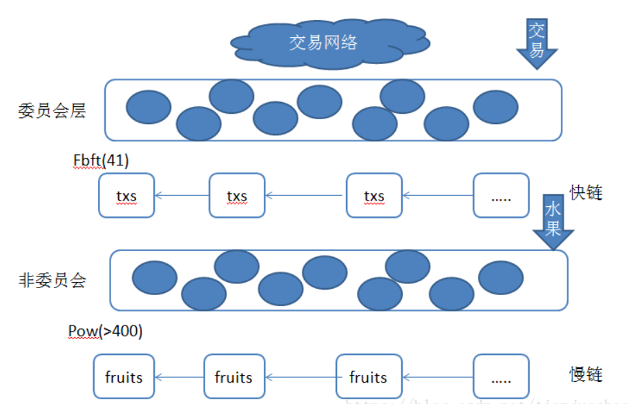
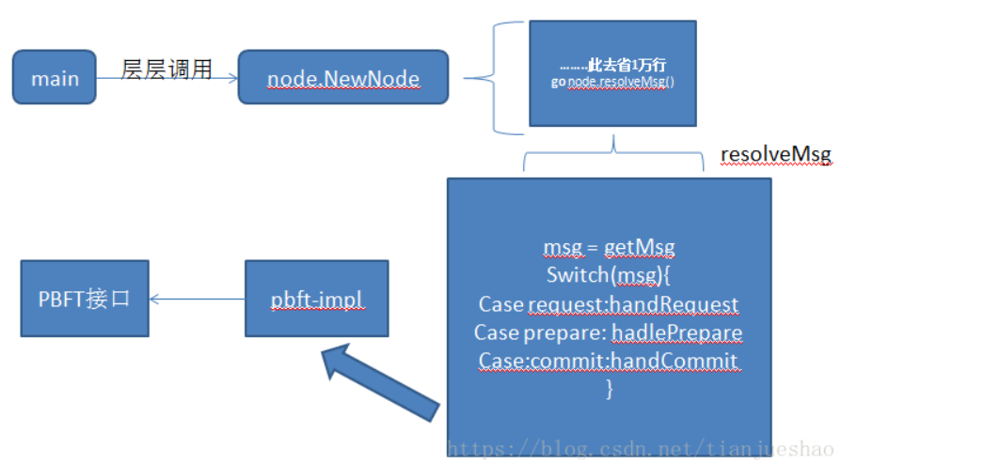
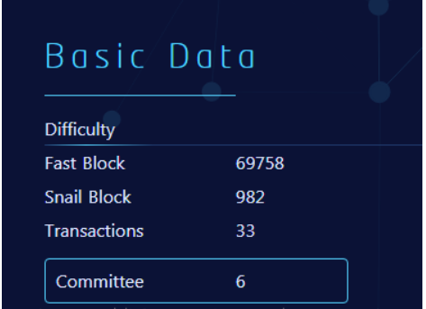
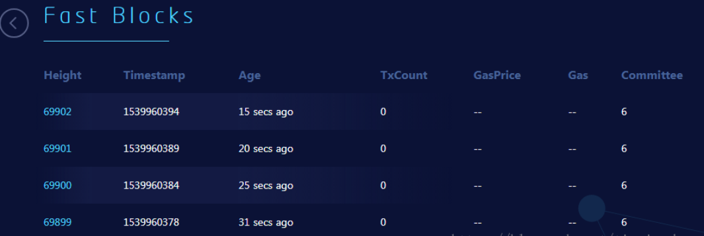
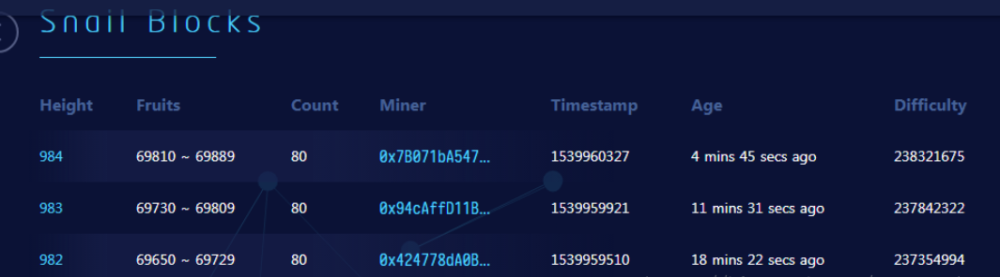

## TrueChain main network - mixed consensus

### Background  
Since its launch in November 2017, after nearly a year of research, development and testing, the Beta version of the TrueChain main network was launched at 08:00 on September 28, 2018, Singapore time. At 07:56, The first consensus of the PBFT committee and the TrueChain fPOW genesis block was mined. In order to let more people understand the TrueChain from technical side, the TrueChain community published some tasks about interpreting the TrueChain technology. I also started this task that is my first blog.

### Description  
The truechain has five highlights, mixed consensus, FPow public chain, TrueHash anti-ASIC mining algorithm, PBFT committee's random election mechanism, high TPS. This article is mainly for the interpretation of the mixed consensus of the truechain. Following interpret other highlights.

### Glossary  
Consensus: It is a common understanding that the early consensus algorithm in the blockchain world was the PoW in bitcoin. PoW is the previous block has a random number. Everyone has to guess, whoever guesses first has the right to accounting. After the accounting is completed, the block is broadcast to other nodes. If you want to understand from the source code. please refer to the document "PoW mining algorithm principle and its implementation in Bitcoin, Ethereum".

Mixed Consensus: The PoW consensus is safe but not efficient, and very slow in transfer. In order to solve this problem, PoS and DOPS consensus appears, although the efficiency is improved but it is no longer decentralized. In order to find a balance between efficiency and safety, a mixed consensus comes, one consensus-solving bookkeeping, and one consensus-solving decentralization. Let's see the truechain how to finds the balance.

### Technology Architecture  
The truechain uses a double-chain structure, as shown. A fast chain, a slow chain. The fast chain is a trading block, which records a lot of transactions. The slow chain is a fruit block, which records a lot of fruits, the fruit is incremented once, and each fruit maps a transaction block.

  

#### What is the mixed consensus?  
In the true chain, there are two common consensuses: improved PBFT and PoW. PBFT mainly solves the problem of transaction efficiency. As shown in the figure, the committee consists of 41 nodes, which is very small compared to the bitcoin node. When the transaction of the trading network is submitted to the committee network, the transaction can be confirmed very fast, so the transaction efficiency is improved. Pow mainly solves the problem of decentralization. Each fruit has one-to-one correspondence with each fast block. Each fruit will be packaged again by PoW. If you want to tamper with the transaction, you must first tamper with the fruit inside PoW. Control 51% of the power.

Still a little bit confuse! No problem, let's take a look at the actual ones.
There is a very long call stack from start to run bft, as follows, you can find the node's NewNode method.

```
main-->>cmd:StartNode()
cmd-->>node:Start()
node-->>service:start()
service-->>backend-Truechain:Start()
truechain-->>pbft_agent:start()loop()
pbft_agent-->>commitee:PutNodes()
commitee-->>pbftserver:PutNodes()
pbftserver-->>proxy_server:NewServer()
proxy_server-->>node:NewNode()

```

For details about the pbft algorithm, refer to [Link 5]. There are about 5 steps. 1. Request 2. Pre-Prepare 3. Prepare 4. Commit 5.Reply. The true chain has been refactor it. The whole logic is shown in the figure, and the focus is on node's resolveMsg. This method plays a core role in true chain committee and fbft_impl association

  

Related code is as follows:

```go
func NewMerkleNode(left, right *MerkleNode, data []byte) *MerkleNode {
   type PBFT interface {
	StartConsensus(request *RequestMsg) (*PrePrepareMsg, error)
	PrePrepare(prePrepareMsg *PrePrepareMsg) (*VoteMsg, error)
	Prepare(prepareMsg *VoteMsg) (*VoteMsg, error)
	Commit(commitMsg *VoteMsg) (*ReplyMsg, *RequestMsg, error)
}

The implementation class is in pbft_impl.go, only one section is shown here. if you interested in other methods , you can read it by yourself.
func (state *State) PrePrepare(prePrepareMsg *PrePrepareMsg) (*VoteMsg, error) {
	// Get ReqMsgs and save it to its logs like the primary.
	state.MsgLogs.ReqMsg = prePrepareMsg.RequestMsg

	// Verify if v, n(a.k.a. sequenceID), d are correct.
	if !state.verifyMsg(prePrepareMsg.ViewID, prePrepareMsg.SequenceID, prePrepareMsg.Digest) {
		return nil, errors.New("pre-prepare message is corrupted")
	}
	// Change the stage to pre-prepared.
	state.CurrentStage = PrePrepared

	return &VoteMsg{
		ViewID:     state.ViewID,
		SequenceID: prePrepareMsg.SequenceID,
		Digest:     prePrepareMsg.Digest,
		MsgType:    PrepareMsg,
		Height:     prePrepareMsg.Height,
	}, nil
}
There is a block of code  in node.NewNode mentioned above, 
where resolveMsg is to handle the traditional msg of various fbft processes, 
check the msg, and then initiate the next phase of the request.
// Start message dispatcher
	go node.dispatchMsg()

	// Start alarm trigger
	go node.alarmToDispatcher()

	// Start message resolver
	go node.resolveMsg()

	//start backward message dispatcher
	go node.dispatchMsgBackward()

	//start Process message commit wait
	go node.processCommitWaitMessage()

resolveMsg  code show as below 
func (node *Node) resolveMsg() {
	for {
		// Get buffered messages from the dispatcher.
		msgs := <-node.MsgDelivery
		switch msgs.(type) {
		case []*consensus.RequestMsg:
			errs := node.resolveRequestMsg(msgs.([]*consensus.RequestMsg))
			if len(errs) != 0 {
				for _, err := range errs {
					fmt.Println(err)
				}
				// TODO: send err to ErrorChannel
			}
		case []*consensus.PrePrepareMsg:
			errs := node.resolvePrePrepareMsg(msgs.([]*consensus.PrePrepareMsg))
			if len(errs) != 0 {
				for _, err := range errs {
					fmt.Println(err)
				}
				// TODO: send err to ErrorChannel
			}
		case []*consensus.VoteMsg:
			voteMsgs := msgs.([]*consensus.VoteMsg)
			if len(voteMsgs) == 0 {
				break
			}

			if voteMsgs[0].MsgType == consensus.PrepareMsg {
				errs := node.resolvePrepareMsg(voteMsgs)
				if len(errs) != 0 {
					for _, err := range errs {
						fmt.Println(err)
					}
					// TODO: send err to ErrorChannel
				}
			} else if voteMsgs[0].MsgType == consensus.CommitMsg {
				errs := node.resolveCommitMsg(voteMsgs)
				if len(errs) != 0 {
					for _, err := range errs {
						fmt.Println(err)
					}
					// TODO: send err to ErrorChannel
				}
			}
		}
	}
}

```

There is another important question that must be answered. Although the fbft call chain and the fbft process message handling mechanism are now discovered, what is the consensus? This question has not been answered. In fact, the fbft consensus is the leader and fastblock. The code is as follows, with some details omitted in the middle.

```go
App launch will open the maintainer leader election
pbft_agent.go
	case types.CommitteeStart:
				log.Info("CommitteeStart...")
				self.committeeMu.Lock()
				self.setCommitteeInfo(self.NextCommitteeInfo, CurrentCommittee)
				self.committeeMu.Unlock()
				if self.IsCommitteeMember(self.CommitteeInfo) {
					go self.server.Notify(self.CommitteeInfo.Id, int(ch.Option))//Send election notifications Notify is called
pbftserver.work
				}
pbftserver.go work code show as below
func (ss *PbftServerMgr) work(cid *big.Int, acChan <-chan *consensus.ActionIn) {
	for {
		select {
		case ac := <-acChan:
			if ac.AC == consensus.ActionFecth {
				req, err := ss.GetRequest(cid)
				if err == nil && req != nil {
					if server, ok := ss.servers[cid.Uint64()]; ok {
						server.Height = big.NewInt(req.Height)
						server.server.PutRequest(req) Initiate consensus
					} else {
						fmt.Println(err.Error())
					}
				} else {
					lock.PSLog(err.Error())
				}
			} else if ac.AC == consensus.ActionBroadcast {
				ss.Broadcast(ac.Height)
			} else if ac.AC == consensus.ActionFinish {
				return
			}
		}
	}
				
Set yourself as a leader after the election is completed
func (ss *PbftServerMgr) PutCommittee(committeeInfo *types.CommitteeInfo) error {
	lock.PSLog("PutCommittee", committeeInfo.Id, committeeInfo.Members)
	id := committeeInfo.Id
	members := committeeInfo.Members
	if id == nil || len(members) <= 0 {
		return errors.New("wrong params...")
	}
	if _, ok := ss.servers[id.Uint64()]; ok {
		return errors.New("repeat ID:" + id.String())
	}
	leader := members[0].Publickey
	infos := make([]*types.CommitteeNode, 0)
	server := serverInfo{   //The first consensus was completed and the leader was selected.		leader: leader,
		nodeid: common.ToHex(crypto.FromECDSAPub(ss.pk)),
		info:   infos,
		Height: new(big.Int).Set(common.Big0),
		clear:  false,
	}
	for _, v := range members {
		server.insertMember(v)
	}
	ss.servers[id.Uint64()] = &server
	return nil
}
There is a leader judgment action when fb is out of the block.
func (ss *PbftServerMgr) GetRequest(id *big.Int) (*consensus.RequestMsg, error) {
	// get new fastblock create a fastblock
	server, ok := ss.servers[id.Uint64()]
	if !ok {
		return nil, errors.New("wrong conmmitt ID:" + id.String())
	}
	// the node must be leader
	if !bytes.Equal(crypto.FromECDSAPub(server.leader), crypto.FromECDSAPub(ss.pk)) { //Leader judgment
		return nil, errors.New("local node must be leader...")
	}
	lock.PSLog("AGENT", "FetchFastBlock", "start")
	fb, err := ss.Agent.FetchFastBlock()
	lock.PSLog("AGENT", "FetchFastBlock", err == nil, "end")
	if err != nil {
		return nil, err
	}

	if fb := ss.getBlock(fb.NumberU64()); fb != nil {
		return nil, errors.New("same height:" + fb.Number().String())
	}

	fmt.Println(len(ss.blocks))
	sum := ss.getBlockLen()

	if sum > 0 {
		last := ss.getLastBlock()
		if last != nil {
			cur := last.Number()
			cur.Add(cur, common.Big1)
			if cur.Cmp(fb.Number()) != 0 {
				return nil, errors.New("wrong fastblock,lastheight:" + cur.String() + " cur:" + fb.Number().String())
			}
		}
	}

	ss.putBlock(fb.NumberU64(), fb)
	data, err := rlp.EncodeToBytes(fb)
	if err != nil {
		return nil, err
	}
	msg := hex.EncodeToString(data)
	val := &consensus.RequestMsg{ //Return a fastblock consensus message
		ClientID:  server.nodeid,
		Timestamp: time.Now().Unix(),
		Operation: msg,
		Height:    fb.Number().Int64(),
	}
	return val, nil
}

```

I  should have explained the PoW consensus, found that someone wrote very well, you can go links [6] if you interested

### Running status  
Let's take a look at the true chain running.
The operation is as follows: It can be seen that there are 6 committees, 69,758 FBs and 982 SBs. The six committees are for the stability of the main network in the early stage, so 6*0.25=1.2 is allowed to be tolerated. The risk is still relatively high. If two machines are bad guy, it will cause some disaster. I hope the authorities will pay attention to it.



Let’s look at the results of the mixed consensus.
Fast Chain: Most of the block's consensus committees are six, indicating that there is no forks, but there is a question, why is the first block height not one?



Slow chain: Most of the mining addresses are scattered, indicating that the pow effect is still very obvious, and truly decentralized. But most of the blocks have no transactions, because there are no transactions, many empty blocks take up a lot of storage space, and it makes no sense. I want to use a compression technique to compress continuous empty blocks; another way to reduce the block rate and let the rate and transaction volume be linked. Both of these ideas can solve the problem of empty block temporary disk. This is my opinion.



Snail Blocks: Going to SnailBlocks and found no fruit, I don't know if I understand the error, or the browser bug, no fruit found. According to the logic, the fruit should be discovered, and the fruit is used as a voucher for Fast Block packaging. If there is no fruit, it is difficult to say that PoW is working. Hope is a browser bug.

### Conclusion  
After the node is started, a round of fbft consensus election will be initiated first. The election leader has the accounting right, and the accounting type is fastblock. If you want to study the PoW consensus, please refer to the link [6]. These two kinds of consensus are a guarantee of efficiency, a guarantee of security, and a compromise between decentralization and efficiency selection. From the perspective of the running effect of the online, the two kinds of consensus can be perfectly matched, but there are still some shortcomings, such as the empty block temporary disk should be optimized, the fruit can not be viewed in the blockchain browser, the committee has only six, the security needs to be improved. . Finally, the efforts and results of the true chain were gratifying, and a satisfactory answer was given to investors and the community.

### Reference  
1.	https://www.8btc.com/article/106800    On the consensus rules of the Bitcoin system
2.	http://blog.51cto.com/11821908/2059711  Principle of PoW mining algorithm and its implementation in Bitcoin and Ethereum
3. http://www.sohu.com/a/239677141_100092199 What is the secret of the POW+POS mixed consensus mechanism? 
4. https://blog.csdn.net/qq_22269733/article/details/83025225  Truechain main network Beta version of the transaction process analysis
5. https://blog.csdn.net/jerry81333/article/details/74303194/ Briefly describe the blockchain consensus algorithm PBFT (Byzantine fault tolerance), PAXOS, RAFT
6. https://blog.csdn.net/sinat_27935057/article/details/83193018  Truechain main network Beta version slow chain mining analysis
